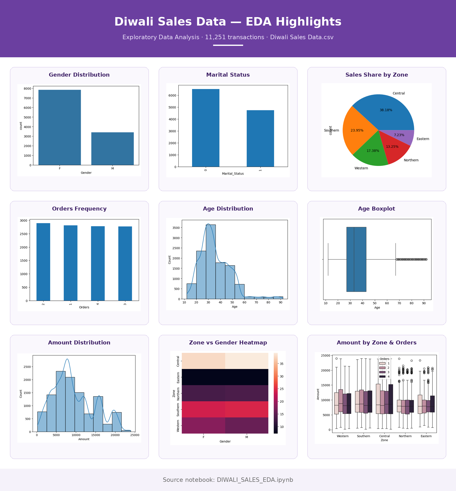

<div align="center">

# 🪔 Diwali Sales — Exploratory Data Analysis

### Uncovering who buys, where they buy, and what they buy during the festive season


<p align="center">
  
</p>

</div>

---

## 📌 Table of Contents

1. [Project Overview](#-project-overview)
2. [Project Structure](#-project-structure)
3. [Dataset](#-dataset)
4. [Tech Stack](#-tech-stack)
5. [Methodology](#-methodology)
6. [Project Poster](#-project-poster)
7. [Key Findings](#-key-findings)
8. [Recommendations](#-recommendations)
9. [Getting Started](#-getting-started)
10. [Author](#-author)

---

## 🎯 Project Overview

This project analyzes Diwali sales transactions to understand customer behavior across demographics, geography, and product categories. It covers **data cleaning**, **univariate analysis**, and **bivariate/multivariate analysis** to turn raw sales data into actionable business insights.

> 📄 The full written report is available in [`Document/Diwali_Sales_EDA_Documentation.pdf`](Document/Diwali_Sales_EDA_Documentation.pdf).

---

## 📂 Project Structure

```text
Diwali-Sales-EDA/
│
├── 📁 Dataset/
│   └── Diwali Sales Data.csv
│
├── 📁 Document/
│   └── Diwali_Sales_EDA_Documentation.pdf
│
├── 📁 Image/
│   └── diwali_sales_eda_poster.png
│
├── 📁 Notebook/
│   └── DIWALI_SALES_EDA.ipynb
│
└── 📄 README.md
```

| Folder | Description |
|:-------|:------------|
| **Dataset** | Source CSV file used for the analysis |
| **Document** | Formal PDF report documenting process and insights |
| **Image** | Project poster and visuals |
| **Notebook** | Jupyter notebook with all code, from cleaning to visualization |

**Image location:** [`Image/diwali_sales_eda_poster.png`](Image/diwali_sales_eda_poster.png)

---

## 📊 Dataset

| Property | Value |
|:---------|:------|
| **File** | `Diwali Sales Data.csv` |
| **Rows** | 11,251 |
| **Columns** | 15 raw → 13 after cleaning |
| **Key fields** | Gender, Age, Marital_Status, State, Zone, Occupation, Product_Category, Orders, Amount |

<details>
<summary><b>View column descriptions</b></summary>

| Column | Type | Description |
|:-------|:-----|:------------|
| `User_ID` | int | Unique customer identifier |
| `Cust_name` | object | Customer name |
| `Product_ID` | object | Unique product identifier |
| `Gender` | object | M / F |
| `Age Group` | object | Age bracket |
| `Age` | int | Customer age |
| `Marital_Status` | int | 0 = unmarried, 1 = married |
| `State` | object | Customer state |
| `Zone` | object | Geographic zone |
| `Occupation` | object | Customer occupation |
| `Product_Category` | object | Category of purchased product |
| `Orders` | int | Quantity ordered |
| `Amount` | float | Transaction value |
| `Status`, `unnamed1` | float | Empty columns (dropped) |

</details>

---

## 🛠 Tech Stack

| Purpose | Tools |
|:--------|:------|
| Language | Python 3 |
| Data manipulation | Pandas |
| Visualization | Matplotlib, Seaborn, Plotly Express |
| Environment | Jupyter Notebook / Google Colab |

---

## 🔬 Methodology

**1. Data Cleaning**
- Dropped fully empty columns: `Status` and `unnamed1`
- Identified **8 duplicate records**
- Imputed **12 missing values** in `Amount` using the median
- Confirmed zero missing values after cleaning

**2. Univariate Analysis**
- Gender, marital status, zone, orders, age, and amount distributions

**3. Bivariate & Multivariate Analysis**
- Zone vs. Gender, top product categories, and amount by zone and order quantity

---

## 🖼 Project Poster

<p align="center">
  
</p>

---

## 💡 Key Findings

| # | Finding |
|:-:|:--------|
| 1 | 👩 **Female customers** purchase substantially more than male customers |
| 2 | 💍 **Unmarried customers** account for a larger share of purchases |
| 3 | 📍 **Central Zone** leads (~38%), followed by Southern (~24%), Western (~17%), Northern (~13%), Eastern (~7%) |
| 4 | 🛒 Customers most frequently order **2 items** per transaction |
| 5 | 🎂 Age concentrated at **25–35 years**, right-skewed with older outliers |
| 6 | 💰 Amounts typically **5,000–10,000**, with a minority of high-value outliers |
| 7 | 🍱 **Food** is the top category (~34M), over 2x Clothing & Apparel (~16.5M) and Electronics & Gadgets (~15.6M) |
| 8 | 📦 Median amounts are similar across zones; Central has the widest spread, Northern and Eastern have more outliers, Western is most consistent |

**Top
